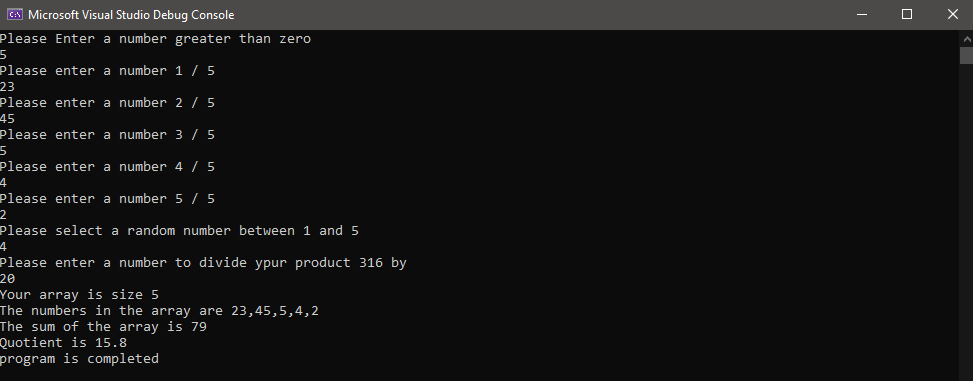

# Lab.01a

## Numbers Game App

### Review 

- This app is communicate with user and make user input what size his own array.
- Push all element consider by array size and make it to chose random number (must number between 1 to array size ).
- Random number is actually is index of array and take this number and multiply be summation of all array element.
- Finally make user enter number and divide this number by result of (all array element * random / user number ).

### What is the purpose of the program?
- Conntrol of user input (always dont trust to user input)
- Create dinamic app depends user input 
- Divide your work (every function one job)

### How do I run the program?
- Just be calling one function in main function StartSequence().
- Wait user input number .

### What does the program look like?

